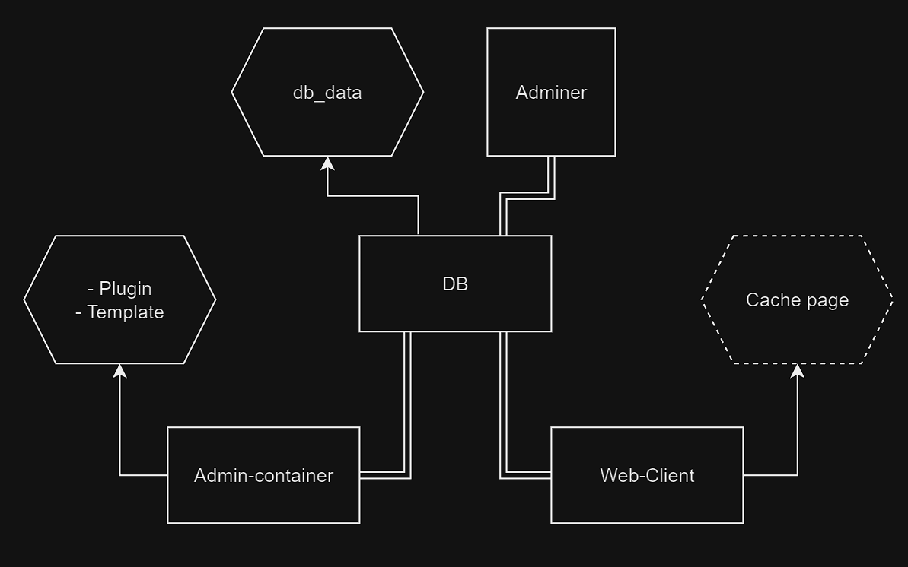

# ui0-CMS
CMS to build website simply without caring about design and code.

# Main plan: Htmx + templ + Go

## Goal

Create at least 2 template for portfolio and blog (allow comment)

- Template
    - List of block type
    - Test enforce
    - List of font allowed
    - Number max character per block type
- Plugin
    - TODO



## Structure

podman/~~docker~~ compose:

- DB -> Postgres
- Backend -> Go 
    - Front generated and serve from back

## Init Repo

If you use podman, download before the docker images:
```bash
podman pull docker.io/postgres
podman pull docker.io/adminer
```

## Start

```bash
./start.sh
```
or
```bash
podman ps && podman-compose --env-file cfg.env -f podman-compose.yml up
```
## Stop
```bash
./stop.sh
```
or
```bash
podman-compose -f podman-compose.yml stop && podman ps
```


# Backup plan: Vue + Go

## Structure

podman/~~docker~~ compose:

- DB -> Postgres
- Backend -> Go 
    - Generate Vue code 
- Front -> Go + Vue
    - Serve static Vue